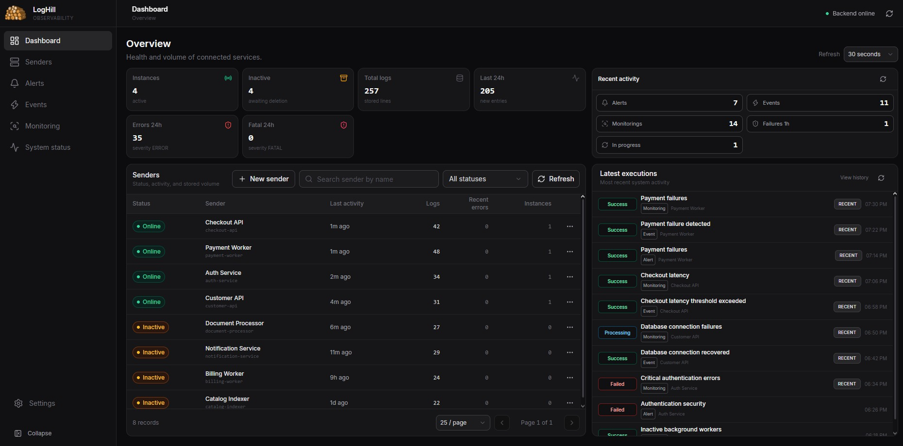
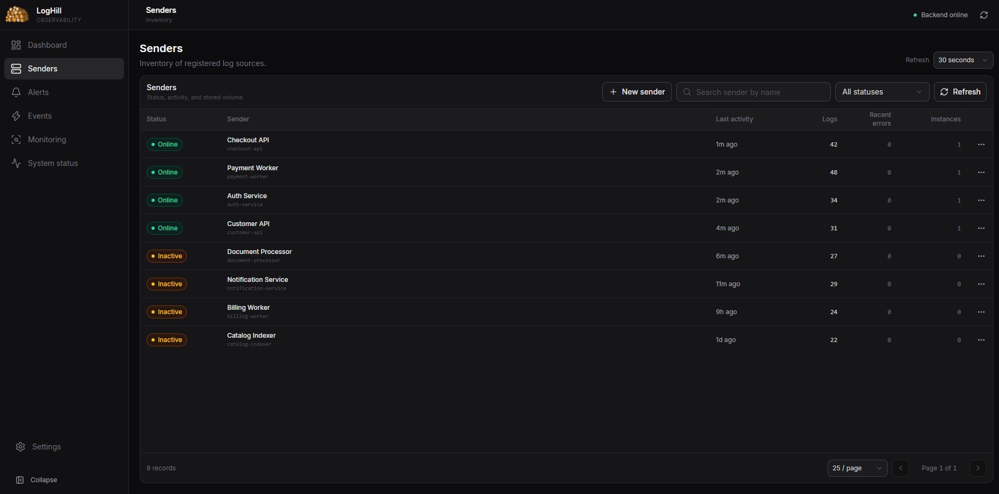
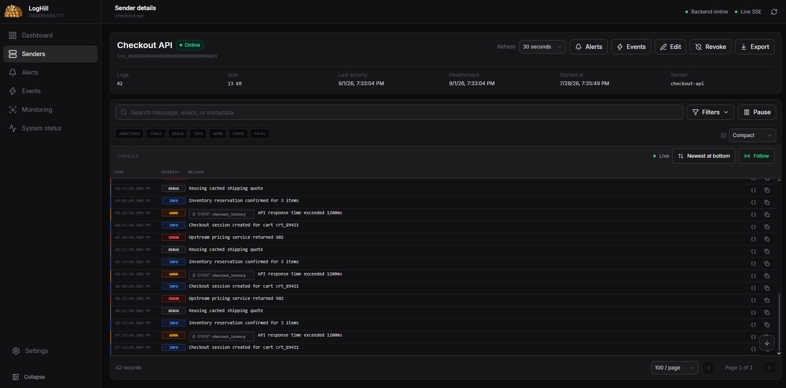
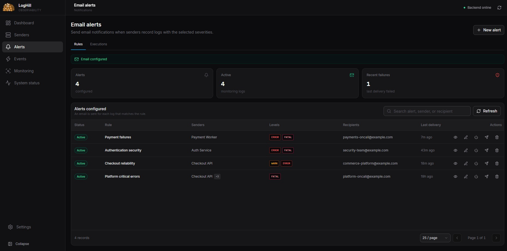
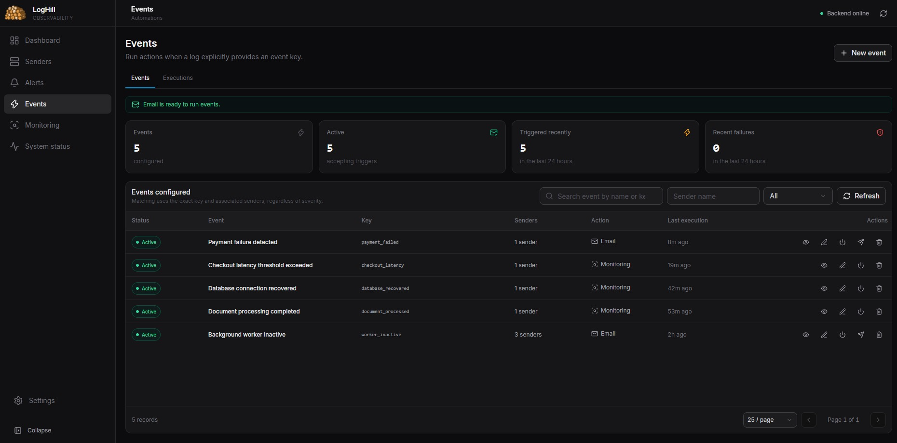
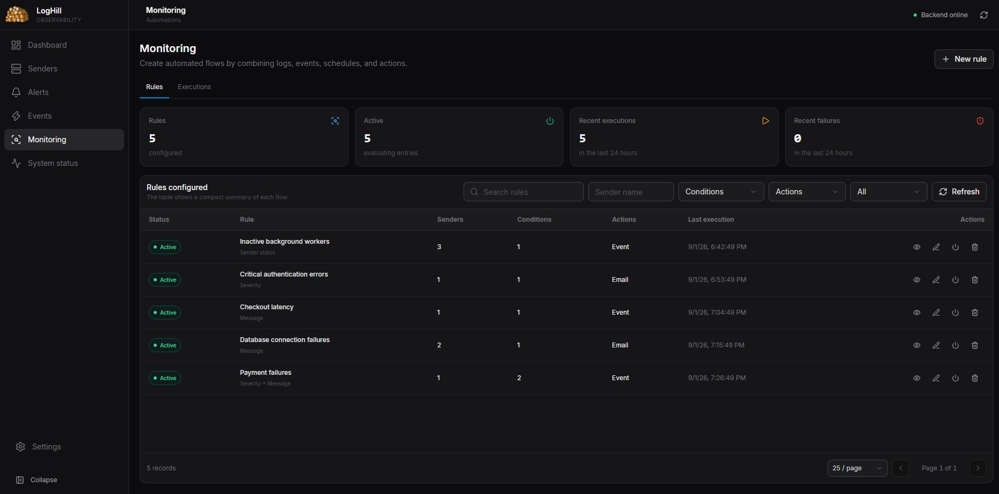
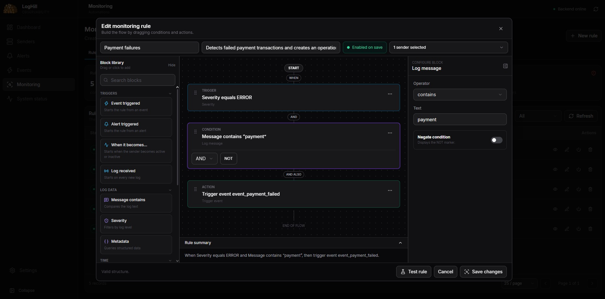
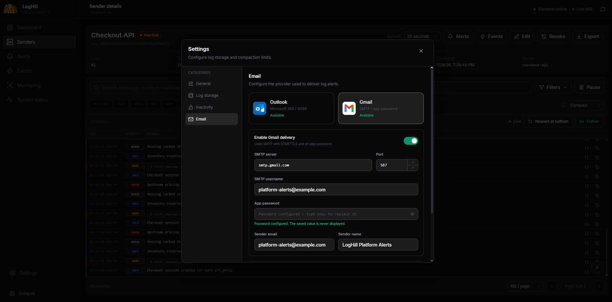

<div align="center">
  

  # LogMate

  **Centralize logs, acompanhe a saúde dos serviços e automatize respostas operacionais.**

  O LogMate reúne logs estruturados, instâncias de aplicações, alertas, eventos, regras de monitoramento e histórico de execuções em uma interface única e leve.

  [](https://go.dev/)
  [](https://react.dev/)
  [](./Dockerfile)
  [](./LICENSE.md)
</div>



## O que é o LogMate

O LogMate é uma plataforma de observabilidade para equipes que precisam centralizar logs sem manter uma infraestrutura distribuída complexa. Aplicações enviam logs por HTTP, cada processo é identificado como uma instância e a interface permite investigar falhas, acompanhar serviços inativos e criar automações sobre os sinais recebidos.

O backend persiste os dados localmente em JSON e JSONL. O frontend React é incorporado ao binário Go, permitindo distribuir o sistema como um único executável ou container com um diretório persistente.

### Principais funcionalidades

- Logs HTTP nos níveis `UNDEFINED`, `TRACE`, `DEBUG`, `INFO`, `WARN`, `ERROR` e `FATAL`.
- Metadata livre e chave de evento opcional em cada registro.
- Criação automática de senders e separação de processos por instância.
- Credencial efêmera exclusiva para cada execução do cliente.
- Console ao vivo via Server-Sent Events (SSE), com pausa, retomada e reconexão.
- Busca em mensagem, evento e metadata; filtros por severidade e período.
- Ordenação, paginação, modos de densidade, follow e exportação de logs.
- Detecção de inatividade, compactação e retenção configuráveis.
- Alertas de e-mail por sender e severidade.
- Eventos explícitos acionados por uma chave enviada com o log.
- Regras low-code com gatilhos, condições lógicas e ações.
- Microsoft Outlook/Microsoft 365 e Gmail SMTP com STARTTLS.
- Histórico unificado de alertas, eventos e monitoramentos.
- Dashboard, healthcheck, readiness e página de status.
- Autenticação administrativa opcional, CORS e rate limit configuráveis.
- OpenAPI e Swagger servidos pela própria aplicação.

## Como o fluxo funciona

```text
Aplicação cliente
    ├─ inicializa uma instância e recebe uma credencial efêmera
    ├─ envia logs, eventos, metadata e healthchecks
    ▼
LogMate API
    ├─ valida e persiste o log
    ├─ publica o registro no stream SSE
    ├─ avalia alertas e eventos associados ao sender
    ├─ processa regras de monitoramento
    └─ registra o resultado no histórico
             ├─ envia e-mail pelo Outlook ou Gmail
             └─ dispara outro evento operacional
```

O recebimento do log não aguarda ações externas, como e-mail ou HTTP. Notificações são persistidas e processadas em segundo plano, evitando que uma indisponibilidade remota interrompa a ingestão.

## Conhecendo as telas

As imagens usam o cenário criado por `go run ./cmd/demo-data`. Serviços, endereços e registros são fictícios.

### Dashboard

O dashboard apresenta:

- instâncias ativas e inativas;
- total de logs e registros das últimas 24 horas;
- ocorrências `ERROR` e `FATAL` recentes;
- quantidade de alertas, eventos e monitoramentos executados;
- falhas da última hora e execuções em andamento;
- lista pesquisável de senders e últimas automações.

No demo, é possível perceber rapidamente quatro serviços online, quatro inativos e uma automação de autenticação com falha. Os cards de atividade levam ao histórico já filtrado.

### Senders e instâncias

Um **sender** representa uma aplicação que produz logs. Uma **instância** representa uma execução concreta desse sender, como um processo, pod, container ou worker.



Na listagem é possível pesquisar, filtrar por status, comparar volume e erros recentes, criar um sender legado, editar informações, revogar ou reativar acesso e excluir depois de revisar dependências.

O demo mostra perfis diferentes: `Checkout API` e `Payment Worker` estão online, enquanto `Billing Worker` e `Catalog Indexer` ficaram inativos por não enviarem atividade no prazo configurado. Se um sender tiver várias instâncias, o LogMate permite selecionar qual execução será investigada, sem misturar logs de processos simultâneos.

### Investigação de logs



A tela de detalhes oferece:

- acompanhamento ao vivo e estado da conexão SSE;
- pausa do stream para estabilizar busca e paginação;
- pesquisa em mensagem, evento e metadata;
- filtros por severidade e intervalo de tempo;
- registros novos no topo ou no final e modo **Follow**;
- densidade compacta ou confortável;
- inspeção e cópia da metadata;
- exportação dos logs;
- acesso aos alertas e eventos associados;
- edição, revogação e remoção de instâncias.

Exemplos do demo incluem uma sessão de checkout criada (`INFO`), latência acima de `1200ms` com o evento `checkout_latency` (`WARN`), falha `502` no serviço de preços (`ERROR`) e reutilização de cache (`DEBUG`). A metadata traz campos como `route`, `duration_ms`, `trace_id`, `region` e `cart_id`.

### Alertas de e-mail

Alertas observam logs de um ou mais senders e disparam quando a severidade pertence à regra. Cada log correspondente gera uma execução independente.



Uma regra contém nome, senders, severidades, até 20 destinatários, provider e estado. A tela mostra última entrega, contadores e falhas, além de permitir testar, editar, ativar, desativar e excluir.

Exemplos:

- **Payment failures:** `ERROR` ou `FATAL` do `Payment Worker` para o plantão de pagamentos;
- **Checkout reliability:** `WARN` ou `ERROR` da `Checkout API`;
- **Authentication security:** erros do `Auth Service` para segurança;
- **Platform critical errors:** `FATAL` em vários serviços.

### Eventos explícitos

Eventos representam situações conhecidas pelo domínio. O cliente envia uma chave estável no campo `event`, evitando depender apenas do texto da mensagem.



O matching exige evento ativo, chave exata e sender associado; a severidade não participa. O evento pode somente registrar a ocorrência ou enviar um e-mail personalizado.

| Chave do demo | Significado | Sender |
| --- | --- | --- |
| `payment_failed` | Transação de pagamento falhou | Payment Worker |
| `checkout_latency` | Checkout ultrapassou o limite de latência | Checkout API |
| `database_recovered` | Conexão com o banco foi restabelecida | Customer API |
| `document_processed` | Processamento de documento terminou | Document Processor |
| `worker_inactive` | Worker parou de reportar atividade | Workers de background |

Templates aceitam `{{event.name}}`, `{{sender.name}}`, `{{log.message}}`, `{{log.severity}}`, `{{metadata.protocolo}}` e `{{app.public_url}}`. O conteúdo é escapado no HTML.

### Monitoramento low-code

O monitoramento combina gatilhos, condições e ações. Regras ativas são indexadas por sender para avaliar somente os fluxos relevantes.



É possível pesquisar, filtrar por sender, condição, ação ou status, visualizar métricas, duplicar regras e consultar execuções. Exemplos do demo:

- mensagem contendo `Connection refused` → e-mail para o plantão;
- mensagem contendo `response time exceeded` → evento de latência;
- `ERROR` no serviço de autenticação → e-mail para segurança;
- sender passando para inativo → evento `worker_inactive`;
- erro cuja mensagem contém `payment` → evento operacional.

### Editor visual de regras



O fluxo é organizado em:

1. **Gatilho:** log, evento, alerta ou mudança de status.
2. **Condições:** mensagem, severidade, metadata, horário, dia, data ou espera futura.
3. **Ações:** disparar evento, enviar e-mail ou chamar um endpoint HTTP.

Condições usam `E`, `OU` e `NÃO`. Blocos podem ser adicionados por clique ou drag-and-drop e reordenados. Na imagem, a regra recebe logs do `Payment Worker`, exige `ERROR`, procura `payment` na mensagem e dispara `payment_failed`.

Regras incompletas podem ser salvas como rascunho. O teste usa um contexto fictício e informa quais condições corresponderiam sem executar ações.

### Histórico de execuções

Alertas, eventos e monitoramentos compartilham um histórico pesquisável. Cada registro informa origem, sender, gatilho, condições, ações, tentativas, duração, correlation ID, causation ID e erro sanitizado. Os estados possíveis são `pending`, `processing`, `success`, `partial`, `failed`, `cancelled` e `skipped`.

É possível filtrar por origem, status, sender, texto e período. Excluir uma regra não apaga automaticamente seu histórico.

### Configuração de e-mail



Em **Configurações → E-mail**, escolha:

- **Outlook/Microsoft 365:** OAuth 2.0 Client Credentials pelo Microsoft Graph;
- **Gmail:** SMTP na porta `587` com STARTTLS e senha de aplicativo.

A interface testa a conexão e envia e-mail de teste. Secrets são criptografados com AES-256-GCM, nunca retornam pela API e aparecem somente como “configurados”. A chave pode vir de `EMAIL_SETTINGS_ENCRYPTION_KEY` ou ser gerada no diretório de dados.

### Configurações e status

As configurações controlam limite e compactação dos logs, tempo para uma instância ficar inativa, retenção antes da exclusão e provider de e-mail. **System status** exibe saúde da API, uptime, senders e disponibilidade do armazenamento. Os mesmos sinais estão em `/health` e `/ready`.

## Início rápido com Docker

Requer Docker com Compose v2.

```bash
git clone https://github.com/pedroborgesdev/logmate-backup.git
cd logmate-backup
docker compose up -d --build
```

Abra [http://localhost:8080](http://localhost:8080). O Compose compila a aplicação, publica `8080`, persiste `/app/data` em `./data`, reinicia o container e verifica `/health`.

```bash
docker compose logs -f logmate
docker compose down
```

> Em produção, defina `APP_PASSWORD`, use TLS e armazenamento persistente. Não use `docker compose down -v` se um volume nomeado contiver dados importantes.

Veja o [guia de instalação](./INSTALATION.md) para binário nativo, systemd, GHCR, atualização, backup e troubleshooting.

## Cenário demonstrativo

O gerador cria oito serviços, logs variados, metadata, alertas, eventos, regras e execuções recentes. Requer Go 1.24+, Node.js 22+ e npm.

```bash
git clone https://github.com/pedroborgesdev/logmate-backup.git
cd logmate-backup
go run ./cmd/demo-data

cd frontend
npm ci
npm run build
cd ..

go run ./cmd/server
```

Abra `http://localhost:8080` ou a porta definida em `APP_PORT`. O gerador só substitui `data/` quando o diretório está vazio ou foi criado por ele; recusa sobrescrever um ambiente existente. As identidades usam `example.com` e a senha do Gmail é propositalmente inválida.

## Enviando os primeiros logs

### 1. Inicialize uma instância

O endpoint recomendado cria o sender automaticamente:

```bash
curl -X POST http://localhost:8080/api/v1/instances/init \
  -H "Content-Type: application/json" \
  -d '{"sender_name":"Automacao Financeira"}'
```

```json
{
  "sender_id": "automacao-financeira",
  "instance_id": "ins_0123456789abcdef0123456789abcdef",
  "instance_token": "inst_credencial_exclusiva_da_execucao",
  "initialized_at": "2026-09-01T12:00:00Z"
}
```

O token aparece uma vez, deve ficar na memória e nunca ser gravado em logs. O servidor guarda apenas seu hash.

### 2. Envie um log

```bash
curl -X POST http://localhost:8080/api/v1/logs \
  -H "Content-Type: application/json" \
  -H "X-Sender-Instance-ID: ins_0123456789abcdef0123456789abcdef" \
  -H "X-Sender-Instance-Token: inst_credencial_exclusiva_da_execucao" \
  -d '{
    "sender_id": "automacao-financeira",
    "severity": "ERROR",
    "message": "Falha ao processar boleto",
    "event": "boleto_failed",
    "event_occurrence_id": "boleto-ABC-123-tentativa-2",
    "metadata": {"protocolo":"ABC-123","tentativa":2,"retryable":true}
  }'
```

`timestamp`, `event` e `event_occurrence_id` são opcionais. Sem timestamp, o servidor usa o horário de recebimento. Um evento só dispara definições ativas associadas ao sender. Para retries seguros, reutilize o mesmo `event_occurrence_id`: o mesmo sender e payload recebem novamente o resultado original, sem criar outro log nem executar as automações outra vez. Reutilizar a chave com conteúdo diferente retorna `409 EVENT_OCCURRENCE_CONFLICT`.

### 3. Mantenha a instância online

Em períodos sem logs, envie healthchecks autenticados. O contrato completo está em [`docs/openapi.yaml`](./docs/openapi.yaml) e na interface `/docs`.

## Cliente Python de exemplo

[`examples/logmate.py`](./examples/logmate.py) inicializa instâncias, mantém healthchecks, envia em background e pode capturar `stdout`, `stderr`, tracebacks e subprocessos.

```python
from logmate import instrument

log = instrument(
    name="worker-financeiro",
    sender_name="Automacao Financeira",
    api_url="http://localhost:8080",
)

log.info(
    "Boleto processado",
    event="boleto_processado",
    metadata={"protocolo": "ABC-123", "duracao_ms": 842},
)

log.error(
    "Falha ao consultar o banco",
    metadata={"database": "financeiro-primary", "retryable": True},
)
```

Instrumente antes de importar frameworks como Uvicorn. Veja [Cliente de logs](./docs/sender-client.md) para handshake, fila SQLite, captura de descritores e compatibilidade legada.

## Configuração

O servidor lê variáveis de ambiente e o `.env` do diretório de trabalho. Comece por [`.env.example`](./.env.example):

```bash
cp .env.example .env
```

```env
APP_HOST=0.0.0.0
APP_PORT=8080
APP_PUBLIC_URL=http://localhost:8080
DATA_DIR=./data
APP_PASSWORD=troque-por-uma-senha-forte
TZ=America/Sao_Paulo
```

| Variável | Padrão | Finalidade |
| --- | --- | --- |
| `APP_PORT` | `8080` | Porta HTTP |
| `APP_PUBLIC_URL` | `http://localhost:8080` | Links das notificações |
| `DATA_DIR` | `./data` | Diretório persistente |
| `APP_PASSWORD` | vazio | Login e chave administrativa |
| `MAX_LOG_LINES` | `100000` | Limite antes da compactação |
| `INACTIVE_AFTER` | `5m` | Prazo para marcar instância inativa |
| `DELETE_AFTER` | `168h` | Retenção de instâncias inativas |
| `MAX_BODY_SIZE` | `1048576` | Limite do corpo HTTP |
| `CORS_ENABLED` | `false` | Ativa CORS configurável |
| `RATE_LIMIT_ENABLED` | `false` | Ativa limitação de requisições |
| `SSE_HEARTBEAT_INTERVAL` | `20s` | Heartbeat dos streams |
| `EXECUTION_HISTORY_RETENTION_DAYS` | `90` | Retenção do histórico |
| `EXECUTION_HISTORY_MAX_RECORDS` | `100000` | Limite do histórico |

Outlook, Gmail, filas, retries, SSE e limites de payload estão detalhados em [`.env.example`](./.env.example).

## Autenticação e segurança

Com `APP_PASSWORD`, o login é exigido. Endpoints administrativos aceitam a sessão web ou `X-API-Key` com a mesma senha. Ingestão usa `X-Sender-Instance-ID` e `X-Sender-Instance-Token` válidos para o sender.

Também há limites de corpo, mensagem, metadata e paginação; headers de segurança; CORS desabilitado por padrão; rate limit opcional; recuperação de panics; secrets criptografados e erros sanitizados. Para acesso externo, use TLS, senha forte e restrinja a API administrativa.

## Persistência e backup

`DATA_DIR` contém senders, instâncias, logs, configurações, automações, a outbox de notificações, histórico e chave de criptografia. Para backup consistente, pare a aplicação e copie o diretório inteiro. `email-encryption.key` deve acompanhar `email-settings.json`.

O modo recomendado é uma única instância com armazenamento local. Mais de um processo pode compartilhar o mesmo `DATA_DIR`: locks de arquivo serializam as alterações e evitam escritas concorrentes sobre o mesmo sender ou sobre a outbox. Réplicas apontando para diretórios diferentes continuam com estados independentes; compartilhamentos de rede só são seguros quando preservam locks e renames atômicos.

## Desenvolvimento

Requer Go 1.24+, Node.js 22+ e npm.

```bash
cd frontend
npm ci
cd ..
```

Depois, execute `make backend` e `make frontend` em terminais separados.

| Comando | Ação |
| --- | --- |
| `make build` | Compila frontend e binário Go |
| `make test` | Testes Go com race detector e testes React |
| `make lint` | `go vet` e ESLint |
| `make docker` | Sobe Docker Compose |

## Arquitetura

```text
cmd/server/             inicialização do servidor
cmd/demo-data/          gerador do demo
internal/routes/        rotas e middlewares
internal/controllers/   validação e respostas HTTP
internal/services/      regras de senders e logs
internal/repositories/  persistência local
internal/alerts/         regras de alertas
internal/events/         matching de eventos
internal/monitoring/     runtime low-code
internal/notification/   fila, templates e despacho
internal/executions/     histórico unificado
frontend/                React, TypeScript, Vite e Tailwind
web/dist/                frontend incorporado no binário
docs/                    guias e OpenAPI
```

O backend segue `routes → controllers → services → repositories`. Veja [Arquitetura da API](./docs/architecture.md).

## API e endpoints operacionais

- Interface: [http://localhost:8080](http://localhost:8080)
- Swagger: [http://localhost:8080/docs](http://localhost:8080/docs)
- OpenAPI: [http://localhost:8080/openapi.yaml](http://localhost:8080/openapi.yaml)
- Liveness: [http://localhost:8080/health](http://localhost:8080/health)
- Readiness: [http://localhost:8080/ready](http://localhost:8080/ready)

## Limitações atuais

- Réplicas só compartilham estado quando usam o mesmo `DATA_DIR` em um filesystem compatível com locks e rename atômico.
- A outbox recupera pendências após reinício e oferece entrega pelo menos uma vez; uma queda depois do envio e antes da confirmação ainda pode duplicar uma notificação.
- Eventos oferecem `none`, `email`, webhook HTTPS e requisições HTTP configuráveis; comandos locais ainda não estão disponíveis.

## Documentação adicional

- [Instalação e operação](./INSTALATION.md)
- [Cliente de logs e instâncias](./docs/sender-client.md)
- [Alertas de e-mail](./docs/alerts.md)
- [Eventos explícitos](./docs/events.md)
- [Monitoramento low-code](./docs/monitoring.md)
- [Arquitetura da API](./docs/architecture.md)
- [Contrato OpenAPI](./docs/openapi.yaml)

## Licença

Distribuído sob a [Licença MIT](./LICENSE.md).
