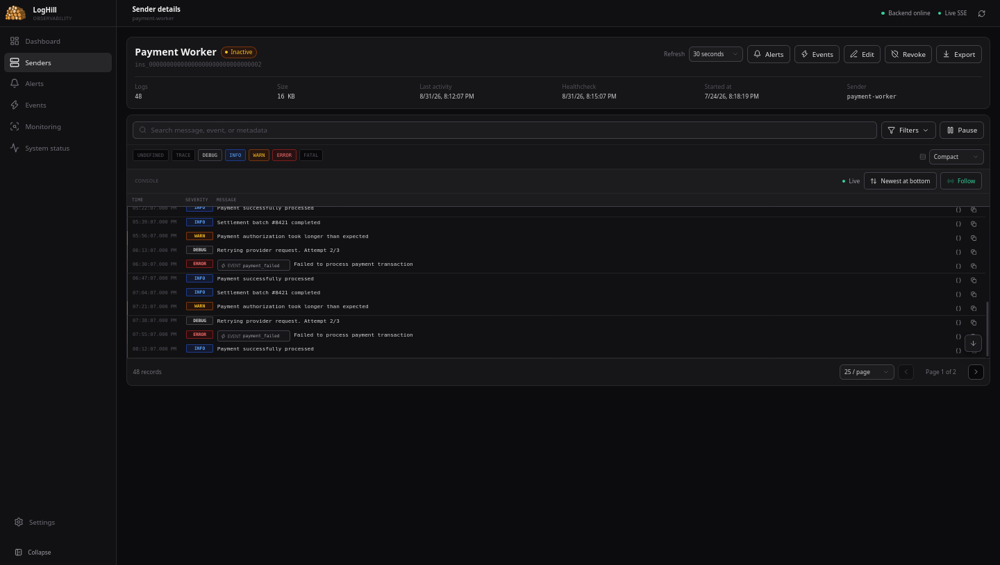
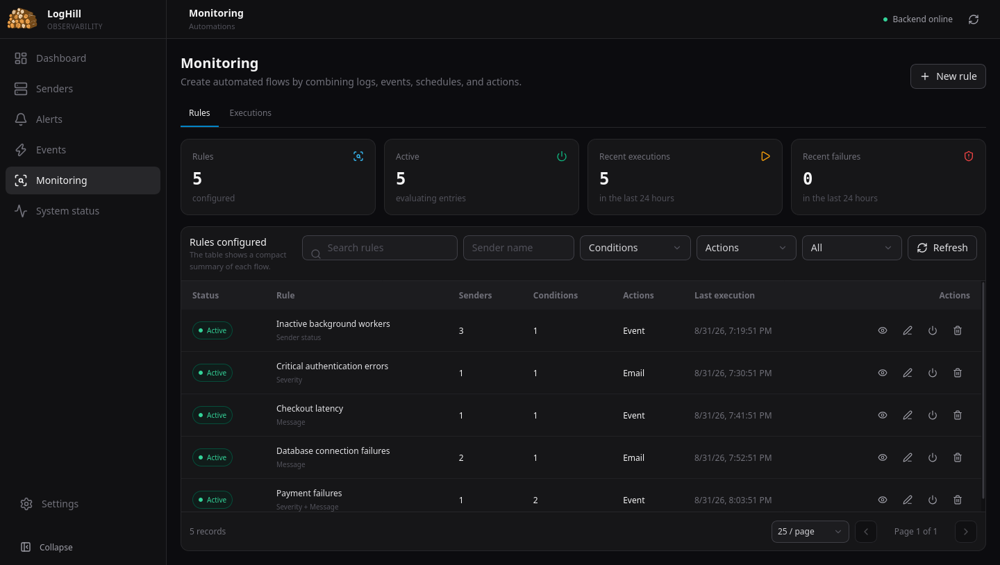
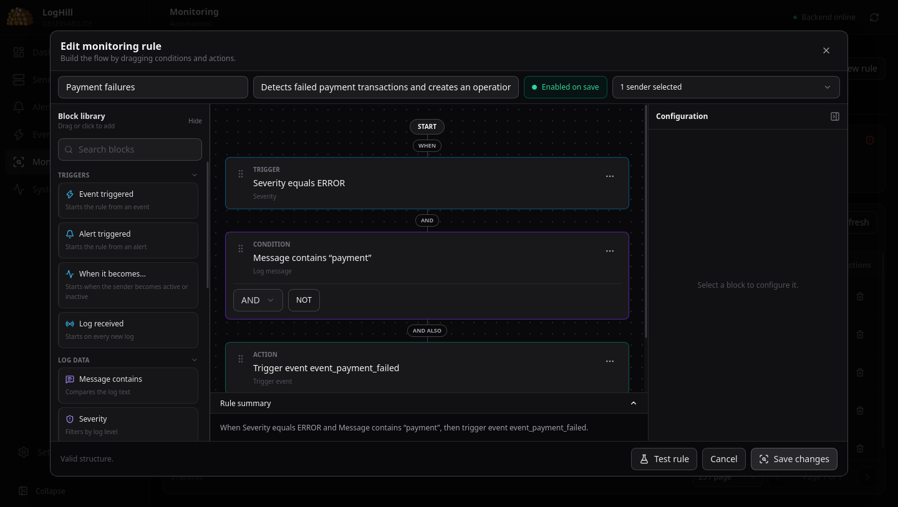
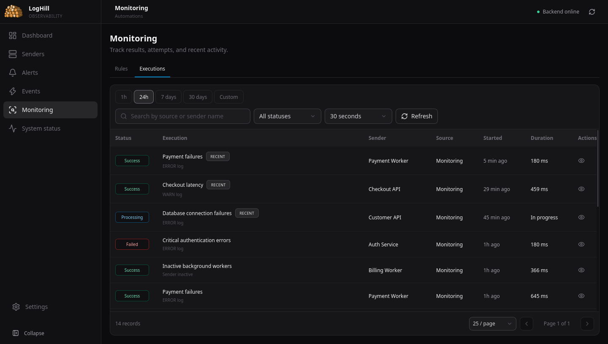
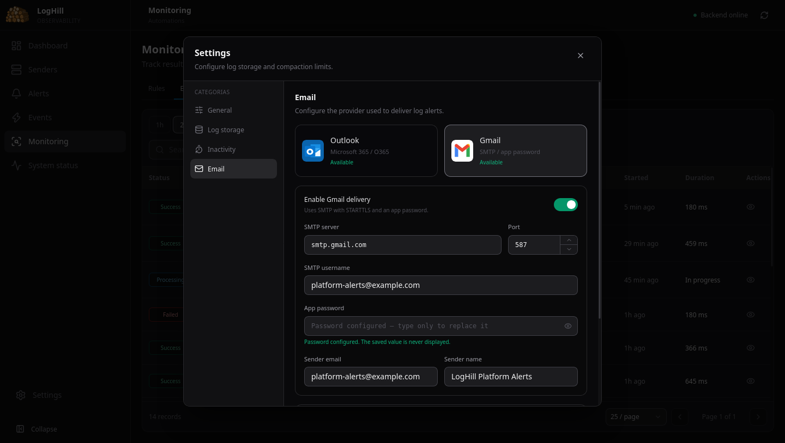

<div align="center">
  

  # LogHill

  **Centralize logs. Detect problems. Automate the response.**

  LogHill brings application logs, service health, monitoring rules, alerts, events, and execution history into one focused interface.

  [](https://go.dev/)
  [](https://react.dev/)
  [](./Dockerfile)
  [](./LICENSE.md)
</div>


## Know what is happening across your services

Applications send their logs to LogHill, where a team can see which services are active, how much activity they produce, and where errors are happening. The dashboard combines operational health with the latest alert, event, and monitoring executions.

- Follow multiple applications from one place.
- Search and filter structured logs in real time.
- Separate each running process into its own instance.
- Detect important log patterns with monitoring rules.
- Send email alerts through Outlook or Gmail.
- Track every automation attempt in a shared execution history.
- Run as a single binary or a Docker container with local persistence.

## Logs with the context needed to investigate

Open any sender to inspect its activity, filter by severity, search messages and metadata, follow live output, or pause the stream while investigating. LogHill supports `TRACE`, `DEBUG`, `INFO`, `WARN`, `ERROR`, `FATAL`, and undefined log levels.



Each entry can carry an event key and structured metadata, making it possible to connect an operational symptom to the service, instance, request, provider, or workflow that produced it.

## Turn log signals into monitoring flows

Monitoring rules combine triggers, conditions, and actions. A rule can react to received logs, sender status changes, explicit events, severity, message content, metadata, dates, weekdays, or time windows.



The visual editor makes the complete flow readable at a glance. The example below detects an `ERROR` whose message contains “payment” and triggers a dedicated operational event.



## Alerts and explicit events

Email alerts watch selected senders and severities, then notify the configured recipients. Rules can cover one service or a group of related applications.


Events provide a stable key that applications can include with a log. They are useful for meaningful business and operational milestones such as a payment failure, checkout latency, database recovery, or completed document processing.


## A history for every automation

Alerts, events, and monitoring rules share a searchable execution history. Results include the source, sender, trigger, evaluated conditions, actions, attempts, duration, and diagnostics when something fails.



## Email delivery without exposing stored secrets

LogHill supports Microsoft Outlook through Microsoft Graph and Gmail through SMTP with STARTTLS. Saved credentials are encrypted locally and are never returned to the interface.



The repository demo uses only fictional `example.com` identities and an intentionally non-functional encrypted password.

## Try the populated demo

The demo generator recreates the exact scenario shown above in the standard `data/` directory: eight services, varied logs, alerts, events, monitoring rules, and recent executions.

Requirements: Go 1.24+ and Node.js 22+.

```bash
git clone <your-fork-or-repository-url>
cd loghill

go run ./cmd/demo-data

cd frontend
npm ci
npm run build
cd ..

go run ./cmd/server
```

Open [http://localhost:8001](http://localhost:8001).

The generator only replaces `data/` when that directory is empty or was previously created by the generator. It refuses to overwrite an existing LogHill environment.

## Run with Docker

```bash
docker compose up --build
```

The included Compose file exposes LogHill at [http://localhost:8001](http://localhost:8001) and persists its state in `./data`.

For production use, configure `APP_PASSWORD`, publish the application behind TLS, and keep the data directory and provider credentials outside version control. See the [installation guide](./INSTALATION.md) and [OpenAPI specification](./docs/openapi.yaml) for additional setup details.

## Built for a small operational footprint

- **Backend:** Go and Gin
- **Interface:** React, TypeScript, Vite, and Tailwind CSS
- **Live updates:** Server-Sent Events
- **Persistence:** local JSON and JSONL files under `data/`
- **Delivery:** single embedded binary or Docker image
- **Integrations:** Microsoft Graph / Outlook and Gmail SMTP

Additional guides cover [sender clients](./docs/sender-client.md), [alerts](./docs/alerts.md), [events](./docs/events.md), and [monitoring](./docs/monitoring.md).

## License

LogHill is available under the [MIT License](./LICENSE.md).
