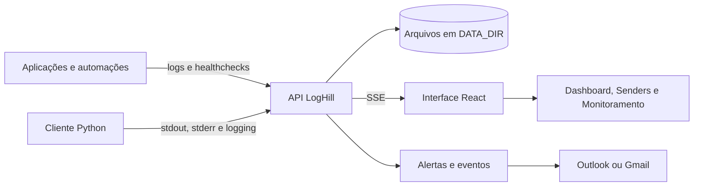

<div align="center">
  

  # LogHill

  **Observabilidade leve, centralizada e em tempo real para aplicações e automações.**

  [](https://go.dev/)
  [](https://react.dev/)
  [](./Dockerfile)
  [](./LICENSE.md)

  [Instalação](./INSTALATION.md) · [API](./docs/openapi.yaml) · [Cliente Python](./docs/sender-client.md) · [Alertas](./docs/alerts.md) · [Eventos](./docs/events.md)
</div>

---

## Sobre o projeto

O LogHill recebe, armazena e apresenta logs de múltiplas aplicações em uma interface única. Cada inicialização de um processo é registrada como uma instância independente, permitindo acompanhar atividade, volume, erros e histórico sem misturar execuções diferentes do mesmo serviço.

O backend é escrito em Go e entrega a API HTTP, streams SSE e o frontend React incorporado no mesmo binário. A persistência utiliza arquivos locais, sem exigir banco de dados ou infraestrutura adicional para começar.

O cliente Python disponível em [`examples/loghill.py`](./examples/loghill.py) também pode instrumentar `stdout` e `stderr`. Isso permite capturar mensagens produzidas por bibliotecas e runtimes, como Uvicorn, sem criar um adaptador específico para cada framework.

## Principais recursos

- **Logs em tempo real:** atualização via Server-Sent Events, com reconexão automática.
- **Captura de terminal:** instrumentação de `stdout`, `stderr` e logging padrão do Python.
- **Senders e instâncias:** cada processo recebe uma identidade de instância própria.
- **Severidades:** `UNDEFINED`, `TRACE`, `DEBUG`, `INFO`, `WARN`, `ERROR` e `FATAL`.
- **Pesquisa e filtros:** mensagem, período, severidade, evento e metadata.
- **Dashboard operacional:** instâncias ativas/inativas, volume e execuções recentes.
- **Ciclo de vida automático:** inativação, compactação e exclusão definitiva após a retenção.
- **Alertas:** regras por sender e severidade com envio assíncrono por Outlook ou Gmail.
- **Eventos explícitos:** ações acionadas por uma chave de evento enviada junto ao log.
- **Monitoramento:** regras compostas, condições e histórico unificado de execuções.
- **Autenticação opcional:** login da interface e acesso administrativo por API key.
- **Distribuição simples:** binário único ou container Docker executado sem privilégios.
- **OpenAPI:** contrato disponível em `/openapi.yaml` e interface Swagger em `/docs`.

## Como funciona



O fluxo recomendado para clientes é:

1. A aplicação informa um `sender_name` ao iniciar.
2. O LogHill cria ou localiza o sender e devolve `sender_id`, `instance_id` e uma credencial temporária da instância.
3. Os logs e healthchecks usam a credencial dessa execução.
4. A interface agrupa as instâncias sob o mesmo sender, sem misturar seus arquivos.
5. Depois do período de inatividade e retenção, a instância é removida definitivamente. Se não restarem instâncias, o sender também desaparece.

## Início rápido

Consulte o guia completo em [INSTALATION.md](./INSTALATION.md).

### Docker Compose

```bash
git clone https://github.com/pedroborgesdev/loghill-backup.git
cd loghill-backup
docker compose up -d --build
```

Acesse:

- Interface: <http://localhost:8001>
- Swagger: <http://localhost:8001/docs>
- Healthcheck: <http://localhost:8001/health>

Os dados são persistidos em `./data` pelo arquivo [`docker-compose.yml`](./docker-compose.yml).

### Binário local

```bash
cd frontend
npm ci
npm run build
cd ..
go build -o log-theater ./cmd/server
./log-theater
```

Para Windows, use `go build -o log-theater.exe ./cmd/server` e execute `./log-theater.exe`.

## Integração com Python

Copie [`examples/loghill.py`](./examples/loghill.py) para o projeto cliente e configure:

```env
LOGHILL_API_URL=http://localhost:8001
LOGHILL_SENDER_NAME=minha-api
LOGHILL_QUEUE_FILE=.loghill/fila.sqlite3
```

Inicialize o LogHill no ponto de entrada da aplicação, antes de importar os módulos que escrevem logs:

```python
from loghill import instrument

log = instrument(name="minha-api")

log.info("Aplicação inicializada")
print("Esta saída também será capturada")
```

`instrument()` é idempotente por PID. Chamadas posteriores reutilizam a mesma instância no processo. Saídas sem severidade reconhecida são armazenadas como `UNDEFINED`.

Consulte [docs/sender-client.md](./docs/sender-client.md) para configuração, eventos, metadata, filas locais e encerramento.

## Exemplo pela API

Inicialize uma instância pelo nome; o sender é criado automaticamente quando ainda não existe:

```bash
curl -X POST http://localhost:8001/api/v1/instances/init \
  -H "Content-Type: application/json" \
  -d '{"sender_name":"minha-api"}'
```

A resposta contém as credenciais que devem acompanhar os logs dessa execução:

```json
{
  "sender_id": "minha-api",
  "instance_id": "ins_...",
  "instance_token": "..."
}
```

Envie um log:

```bash
curl -X POST http://localhost:8001/api/v1/logs \
  -H "Content-Type: application/json" \
  -H "X-Sender-Instance-ID: ins_..." \
  -H "X-Sender-Instance-Token: ..." \
  -d '{"sender_id":"minha-api","severity":"INFO","message":"Processamento iniciado"}'
```

O contrato completo está em [`docs/openapi.yaml`](./docs/openapi.yaml).

## Persistência e ciclo de vida

Os dados ficam sob `DATA_DIR`, organizado por sender e instância:

```text
data/
├── config.json
├── alerts.json
├── events.json
├── executions/
└── senders/
    └── meu-sender/
        ├── sender.json
        ├── instances.json
        └── instances/
            └── ins_.../
                └── logs.txt
```

- Logs e healthchecks contam como atividade da instância.
- Uma instância sem atividade passa a inativa após o prazo configurado.
- Na inativação, o histórico pode ser compactado até o limite de preservação.
- Depois da retenção, instância e logs são excluídos permanentemente.
- Quando a última instância expira, o sender também é removido.
- Escritas de metadata usam arquivo temporário, sincronização e rename atômico.
- Locks são isolados por sender para evitar contenção global durante ingestão.

Faça backup de `DATA_DIR` para preservar logs, configurações, regras, histórico e a chave usada para criptografar credenciais de e-mail.

## Configuração essencial

Copie [`.env.example`](./.env.example) para `.env`. O servidor carrega esse arquivo automaticamente quando iniciado no diretório do projeto.

| Variável | Padrão | Finalidade |
|---|---|---|
| `APP_HOST` | `0.0.0.0` | Endereço de escuta HTTP |
| `APP_PORT` | `8001` | Porta da aplicação |
| `APP_PUBLIC_URL` | `http://localhost:8001` | URL usada em links externos |
| `DATA_DIR` | `./data` | Diretório persistente |
| `APP_PASSWORD` | vazio | Senha da interface e API administrativa |
| `APP_AUTH_ENABLED` | automático | Força autenticação ligada ou desligada |
| `INACTIVE_AFTER` | `5m` | Tempo sem atividade antes da inativação |
| `DELETE_AFTER` | `168h` | Retenção antes da exclusão definitiva |
| `CLEANUP_INTERVAL` | `1m` | Frequência do ciclo de manutenção |
| `MAX_LOG_LINES` | `100000` | Limite legado inicial de linhas |
| `MAX_BODY_SIZE` | `1048576` | Tamanho máximo do corpo HTTP |
| `LOG_LEVEL` | `INFO` | Nível dos logs internos do servidor |
| `SSE_HEARTBEAT_INTERVAL` | `20s` | Intervalo de heartbeat SSE |
| `CORS_ENABLED` | `false` | Ativa política CORS configurável |
| `RATE_LIMIT_ENABLED` | `false` | Ativa limitação de requisições |

Limites de armazenamento, preservação e inatividade também podem ser alterados pela interface em **Configurações** e são persistidos em `data/config.json`.

Consulte [`.env.example`](./.env.example) para todas as opções de e-mail, segurança, SSE e retenção de execuções.

## Alertas, eventos e monitoramento

### Alertas

Alertas combinam senders, severidades e destinatários. A entrega ocorre em background para não bloquear a ingestão. Consulte [docs/alerts.md](./docs/alerts.md).

### Eventos

Eventos são acionados somente quando o cliente envia uma chave explícita no campo `event`. Consulte [docs/events.md](./docs/events.md).

### Monitoramento

Regras de monitoramento combinam condições de log, sender, evento, horário e metadata. As execuções de alertas, eventos e monitoramento compartilham um histórico pesquisável.

## Desenvolvimento

Requisitos:

- Go 1.24 ou superior;
- Node.js 22 ou superior;
- npm;
- Docker e Docker Compose, opcionais.

Backend:

```bash
go run ./cmd/server
```

Frontend com hot reload, em outro terminal:

```bash
cd frontend
npm ci
npm run dev
```

O Vite encaminha `/api`, `/health` e `/ready` para `localhost:8001`.

### Qualidade

```bash
go test -race ./...
go vet ./...

cd frontend
npm run test:run
npm run lint
npm run build
```

Atalhos equivalentes estão disponíveis no [`Makefile`](./Makefile).

## Imagem de container

O [`Dockerfile`](./Dockerfile) usa estágios separados para frontend, backend e runtime. A imagem final:

- contém apenas o executável e a especificação OpenAPI;
- executa como usuário sem privilégios;
- expõe a porta `8001`;
- declara `/app/data` como volume;
- possui healthcheck em `/health`.

O workflow [`.github/workflows/publish-image.yml`](./.github/workflows/publish-image.yml) publica automaticamente:

- `ghcr.io/pedroborgesdev/loghill-backup:latest` em pushes para `master`;
- `ghcr.io/pedroborgesdev/loghill-backup:sha-*` por commit;
- `ghcr.io/pedroborgesdev/loghill-backup:v*` para tags de versão.

## Estrutura do repositório

```text
cmd/server/              entrada do servidor
internal/app/            composição das dependências
internal/controllers/    handlers HTTP
internal/domain/         entidades e contratos internos
internal/repositories/   persistência em arquivos
internal/services/       regras de negócio e ciclo de vida
internal/routes/         rotas da API
internal/middlewares/    autenticação, CORS e rate limit
internal/alerts/         regras de alertas
internal/events/         eventos explícitos
internal/monitoring/     motor de monitoramento
internal/executions/     histórico unificado
internal/emailprovider/  Outlook e Gmail
frontend/                React, TypeScript, Vite e Tailwind
web/dist/                frontend incorporado com go:embed
examples/                cliente e projetos de exemplo
docs/                    OpenAPI e guias adicionais
```

## Segurança

- Defina `APP_PASSWORD` em qualquer ambiente acessível por rede.
- Publique a aplicação atrás de TLS em produção.
- Não versione `.env`, credenciais, filas locais ou `DATA_DIR`.
- Use secrets do orquestrador para Outlook, Gmail e chave de criptografia.
- A imagem Docker executa como usuário não-root.
- A API nunca devolve secrets de provedores de e-mail já armazenados.

## Contribuição

1. Crie uma branch para a alteração.
2. Mantenha o diff focado e adicione testes quando aplicável.
3. Execute testes, lint e build antes de abrir o pull request.
4. Descreva impacto, compatibilidade e forma de validação.

## Licença

Distribuído sob a licença MIT. Consulte [LICENSE.md](./LICENSE.md).
