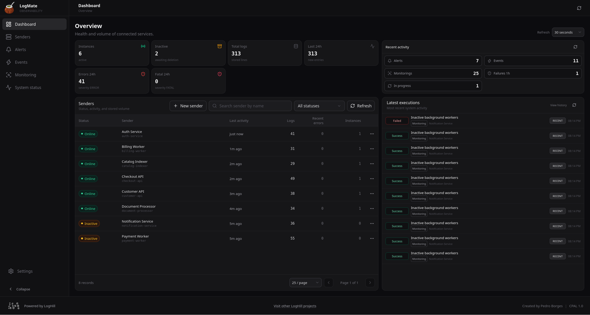
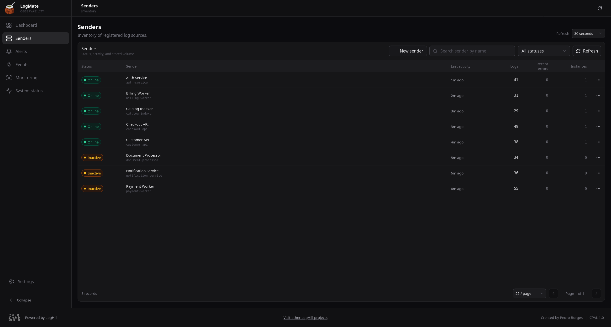
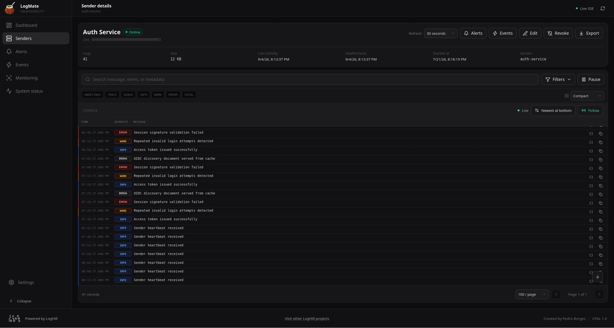
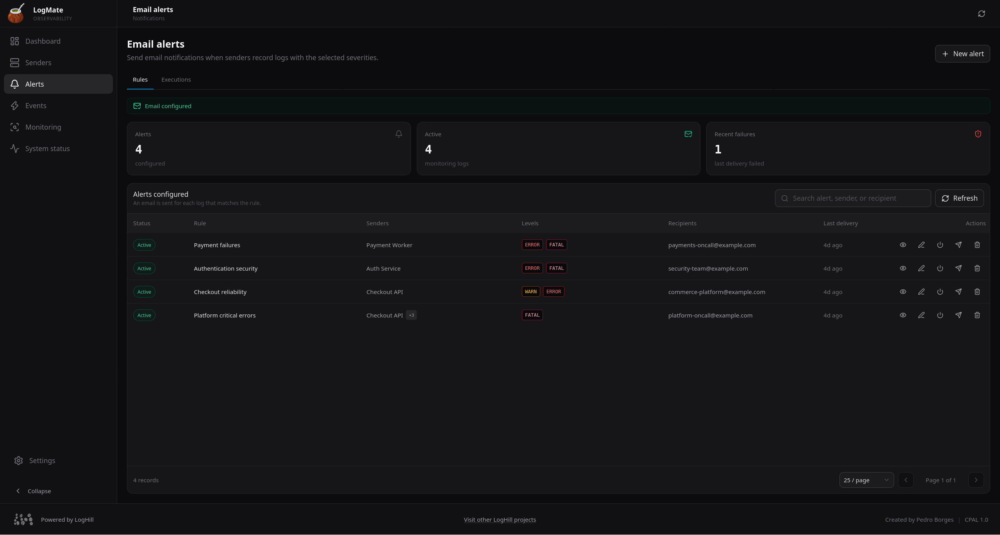
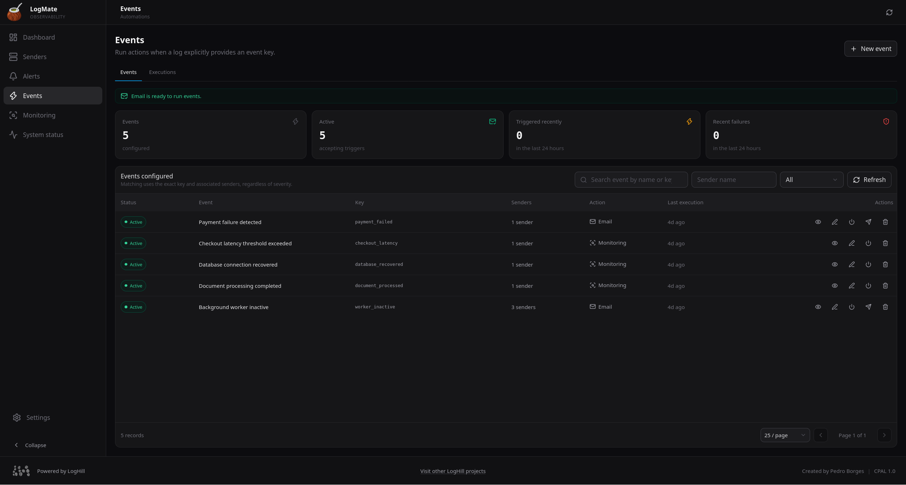

# LogMate

<div align="center">
  

  **Veja o que está acontecendo nos seus serviços.**

  Centralize logs, acompanhe a saúde das aplicações e receba alertas quando algo precisar de atenção.

  [](./Dockerfile)
  [](https://go.dev/)
  [](./LICENSE.md)
</div>

## O LogMate em poucas palavras

O LogMate é um painel para acompanhar suas aplicações em um só lugar. Ele recebe os logs dos seus serviços, mostra o que está saudável, destaca erros e permite criar ações automáticas para situações importantes.

É útil para APIs, workers, jobs, integrações e qualquer aplicação que precise deixar claro quando algo aconteceu ou quando algo deu errado.

## Veja o produto

### Uma visão geral do ambiente

O dashboard mostra rapidamente quais serviços estão ativos, onde estão os erros recentes e como estão as automações.



### Seus serviços organizados

Cada aplicação aparece como um serviço. Você consegue ver a atividade recente e saber quais serviços precisam de atenção.



### Investigação com contexto

Abra um serviço para acompanhar os logs, pesquisar mensagens, filtrar problemas e entender qual instância gerou cada registro.



### Alertas por e-mail

Escolha o que deve gerar um alerta e receba uma notificação quando a condição acontecer. Assim, sua equipe não precisa ficar olhando o painel o tempo todo.



### Eventos importantes

Dê nomes claros para acontecimentos da sua aplicação, como `payment_failed` ou `checkout_latency`, e acompanhe cada ocorrência no painel.



## O que você pode fazer

- **Acompanhar logs ao vivo:** veja novos registros sem atualizar a página.
- **Encontrar problemas rapidamente:** filtre por erro, aviso, período, serviço ou palavra-chave.
- **Saber se um serviço está ativo:** a atividade recente de cada aplicação fica visível.
- **Separar instâncias:** diferencie containers, réplicas, workers e processos do mesmo serviço.
- **Criar alertas:** envie e-mails para as pessoas certas quando algo importante acontecer.
- **Criar eventos:** acompanhe situações de negócio com nomes fáceis de entender.
- **Automatizar monitoramentos:** crie regras com condições e ações pelo editor visual.
- **Consultar o histórico:** veja o que foi executado, o resultado e as falhas.
- **Manter seus dados sob controle:** os dados ficam no diretório local do projeto e podem ser copiados ou restaurados.

## Comece em poucos minutos

### Opção 1: Docker

Você precisa apenas de Docker e Docker Compose.

```bash
docker compose up --build
```

Depois abra [http://localhost:8080](http://localhost:8080).

Para deixar o LogMate rodando em segundo plano:

```bash
docker compose up --build -d
```

### Opção 2: execução local

Com Go, Node.js, npm e Make instalados, execute:

```bash
make run
```

Esse comando prepara a interface, monta o servidor e abre o LogMate. No Windows ele gera e executa `logmate.exe`; no Linux, `./logmate`.

Para parar o serviço, pressione `Ctrl+C` no terminal.

## Seu primeiro passo dentro do LogMate

1. Abra o painel no navegador.
2. Crie um serviço e copie a chave dele.
3. Envie um log da sua aplicação.
4. Volte ao dashboard e veja a atividade aparecer.
5. Configure alertas, eventos ou monitoramentos quando fizer sentido.

Um exemplo de envio:

```bash
curl -X POST http://localhost:8080/api/v1/logs \
  -H 'Content-Type: application/json' \
  -H 'X-Sender-Key: SUA_CHAVE_DO_SERVICO' \
  -d '{
    "severity": "ERROR",
    "message": "Falha ao processar o pagamento",
    "event": "payment_failed",
    "metadata": {
      "pedido": "PED-123",
      "provedor": "payments"
    }
  }'
```

A chave `event` é opcional, mas ajuda a identificar situações conhecidas da aplicação. A `metadata` pode conter pedido, usuário, região, versão, rota ou qualquer outro contexto útil.

## Alertas e notificações

O LogMate pode enviar alertas por e-mail usando Outlook/Microsoft 365 ou Gmail.

Na interface:

1. Abra as configurações de e-mail.
2. Escolha o provedor.
3. Preencha os dados da conta.
4. Teste a conexão.
5. Crie um alerta e escolha os serviços, níveis e destinatários.

Para Gmail, use uma senha de aplicativo. Nunca coloque senhas reais no repositório ou em mensagens de suporte.

## Eventos e monitoramento

Use **Events** quando sua aplicação já sabe o nome de uma situação, como pagamento recusado, pedido criado ou fila acumulada.

Use **Monitoring** quando quiser que o LogMate observe condições e tome uma ação. Por exemplo: reagir a erros repetidos, avisar sobre uma falha ou acompanhar o comportamento de um serviço.

As execuções ficam registradas para que você possa entender o que aconteceu depois, mesmo quando uma ação falhar.

## Quando um serviço fica inativo?

Um serviço é considerado ativo quando continua enviando logs ou sinais de saúde. Se ele ficar sem atividade pelo período configurado, o painel o marca como inativo.

Para aplicações que produzem poucos logs, envie um healthcheck periódico. Isso evita que um serviço saudável pareça inativo apenas porque está quieto.

## Configurações mais importantes

Se precisar personalizar o ambiente, copie o arquivo de exemplo:

```bash
cp .env.example .env
```

| Configuração | Para que serve |
| --- | --- |
| `APP_PORT` | Define a porta do painel e da API. |
| `APP_PASSWORD` | Protege o acesso ao painel com senha. |
| `DATA_DIR` | Define onde os dados serão guardados. |
| `INACTIVE_AFTER` | Define quando um serviço passa a ser considerado inativo. |
| `APP_PUBLIC_URL` | Define a URL usada nos links e e-mails. |
| `EMAIL_PROVIDER` | Escolhe Outlook ou Gmail para notificações. |
| `EXECUTION_HISTORY_RETENTION_DAYS` | Define por quanto tempo o histórico fica disponível. |

O Docker Compose já configura o acesso em `http://localhost:8080`. Todas as opções estão em [.env.example](./.env.example).

## Seus dados

O LogMate guarda os dados em `data/`, incluindo logs, serviços, alertas, eventos e histórico. Para fazer uma cópia:

```bash
docker compose down
cp -a data data-backup
```

Guarde esse backup em um local protegido, pois ele pode conter chaves de serviços e configurações de e-mail.

## Segurança

Antes de disponibilizar o LogMate para outras pessoas:

- defina `APP_PASSWORD`;
- proteja o acesso com HTTPS;
- não compartilhe as chaves dos serviços;
- mantenha o diretório `data/` protegido;
- limite quem pode acessar a porta do LogMate.

## Precisa de mais detalhes?

- [Documentação completa da API](./docs/openapi.yaml)
- [Licença CPAL 1.0](./LICENSE.md)
- A documentação interativa fica disponível em `/docs` com o LogMate rodando.

<div align="center">
  
</div>
